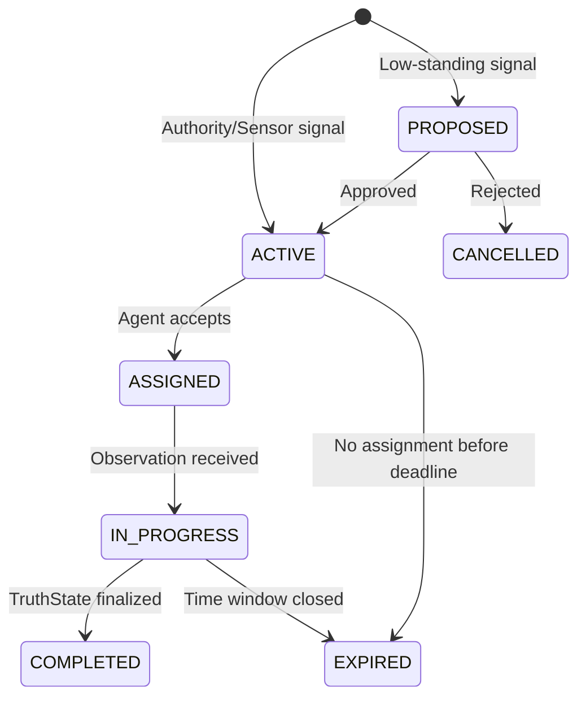

# Kaori Flow — Engineering Specification (v2.2)

> **Status:** Draft v2.2 (Probe-First Architecture)  
> **Maintainer:** MSRO  
> **Scope:** Defines the "Physics of Trust" (Agents, Networks, Signals, Probes) that powers the Kaori Protocol.

---

## 0. Relationship to Kaori Truth Standard

| Specification | Scope |
|---------------|-------|
| **TRUTH_SPEC.md** (Kaori Truth Standard) | Defines *what* constitutes truth and *how* it is validated |
| **FLOW_SPEC.md** (Kaori Flow) | Defines *who* does the work, *when* they do it, and *how* they earn standing |

Kaori Flow operates **on top of** Kaori Truth. Observations submitted through Flow are validated according to the Truth Standard.

> [!IMPORTANT]
> **Normative Boundary:** Truth MUST NOT require Flow primitives to compile truth. Flow primitives (Probes, Agents, Network) are coordination mechanisms. Truth receives observations and produces verified states independently.

---

## 1. Architectural Philosophy: Physics vs. Mechanics

Kaori Flow is distinct from Kaori Truth.

| Layer | Responsibility | Primitives |
|-------|----------------|------------|
| **Kaori Truth** (Mechanics) | Deterministic verification of claims. "What is this vote worth?" | Observations, Votes, Claims |
| **Kaori Flow** (Physics) | Dynamic calculation of trust. "Who is this agent and why do we trust them?" | Agents, Network, Signals, Probes |

---

## 2. Core Primitives (The Physics Layer)

Kaori Flow is built on a **Fractal Graph Architecture**. There is no distinction between an individual and a group; both are Agents.

### 2.1 The Agent (The Cell)

The **Agent** is the atomic unit of the system. An Agent can represent a person, a sensor, a drone, a squad, or an entire organization.

**Structure:**
- **Identity:** Unique UUID.
- **Type:** `individual`, `squad`, `sensor`, `official`.
- **Intrinsic Standing:** A scalar float (0.0 to ∞) representing raw accumulated trust.
- **Genome (Qualifications):** Per-domain capabilities (e.g., `earth.flood: expert`).
- **Activity Record:** Immutable ledger of interactions.

#### Standing (Normative Definition)

Standing is a **continuous scalar float** (canonical representation). Standing classes are **derived** for backwards compatibility:

```python
def derive_standing_class(standing: float) -> str:
    """Derive standing class from scalar value."""
    if standing < 100:
        return "bronze"
    elif standing < 250:
        return "silver"
    elif standing < 500:
        return "expert"
    else:
        return "authority"
```

| Standing Value | Derived Class | Typical Role |
|----------------|---------------|--------------|
| 0 – 99 | `bronze` | New/Unverified |
| 100 – 249 | `silver` | Verified Contributor |
| 250 – 499 | `expert` | Domain Expert |
| 500+ | `authority` | Official/Calibrated Sensor |

### 2.2 The Network (The Tissue)

The **Network** defines the relationships between Agents. Trust flows through these edges.

**Edge Types:**
*   **Trust Edges:**
    *   `VOUCH (A -> B)`: A explicitly trusts B. Transfer of standing.
    *   `MEMBER_OF (A -> B)`: A is part of Squad B. Enables **Fractal Trust Inheritance**.
*   **Signal Edges:**
    *   `COLLABORATE (A <-> B)`: History of agreeing on verified truth. Forms "Squads".
    *   `CONFLICT (A <-> B)`: History of disagreement. Defines "Independence".

### 2.3 Signals (The Chemical Gradient)

Signals are immutable event envelopes that propagate through the Network to trigger reactions.

> [!IMPORTANT]
> **Signals are immutable. Probes are stateful.** A Signal MUST NOT contain an embedded Probe. The SignalProcessor creates or mutates Probes in response to Signals.

#### Signal Primitives

```python
class Signal:
    id: UUID
    type: SignalType          # Source category
    source_id: str            # Emitter (Sensor, User, System)
    timestamp: datetime
    data: dict                # Payload (claim_type, scope, severity)
```

#### Signal Types

| Signal Type | Emitter | Purpose |
|-------------|---------|---------|
| `AUTOMATED_TRIGGER` | IoT, External APIs | Raw environmental alert (e.g., "Rain > 50mm") |
| `MANUAL_TRIGGER` | Human User | User explicit intent (e.g., "Create Probe") |
| `SCHEDULED_TRIGGER` | Scheduler | Time-based intent (e.g., "Daily Check") |
| `SYSTEM_ALERT` | Internal Logic | Contradiction or Low Confidence flag |

### 2.4 Probes (The Coordination Object) — FLOW PRIMITIVE

> [!IMPORTANT]
> **Probe is a first-class primitive of Kaori Flow (Normative).**
> - Flow MUST define and manage Probe creation, dedupe, lifecycle, assignment, expiry.
> - Kaori Truth MUST NOT require Probes to compile truth.
> - Truth MAY reference `probe_id` only as optional provenance metadata.

A **Probe** is a persistent, stateful coordination object that directs agents to gather observations.

#### Probe Schema

```json
{
  "probe_id": "uuid",
  "probe_key": "string (deterministic)",
  "claim_type": "earth.flood.v1",
  "scope": {
    "spatial": { "type": "h3", "value": "886142a8e7fffff" },
    "temporal": { "start": "ISO8601", "end": "ISO8601" }
  },
  "status": "PROPOSED|ACTIVE|ASSIGNED|IN_PROGRESS|COMPLETED|EXPIRED|CANCELLED",
  "created_by_signal": "signal_id",
  "active_signals": ["signal_id_1", "signal_id_2"],
  "requirements": {
    "min_effective_power": 250,
    "required_edges": []
  },
  "expires_at": "ISO8601",
  "created_at": "ISO8601",
  "updated_at": "ISO8601"
}
```

#### ProbeKey (Deterministic Dedupe Key)

ProbeKey MUST be derived deterministically from claim_type + scope:

```
ProbeKey = hash(claim_type + spatial_id + z_index + time_bucket)
```

Or equivalently:

```
ProbeKey = claim_type + ":" + TruthKey
```

This enables:
- Idempotent Probe creation
- Distributed correctness
- Replay safety

#### Probe Lifecycle



| Status | Description |
|--------|-------------|
| `PROPOSED` | Created by low-standing signal, awaiting approval |
| `ACTIVE` | Approved and open for assignment |
| `ASSIGNED` | Linked to an Agent |
| `IN_PROGRESS` | At least one observation received |
| `COMPLETED` | TruthState finalized (VERIFIED_TRUE/FALSE) |
| `EXPIRED` | Time window closed without finalization |
| `CANCELLED` | Administratively cancelled |

### 2.5 The Signal Processor (The Reflex Arc)

The **Signal Processor** is the core logic engine that transmutes Signals into Probe mutations.

**Workflow:**
1. **Ingest:** Receive `Signal` from any source.
2. **Authenticate:** Check `source_id` standing (e.g., Is this user an Authority?).
3. **Compute ProbeKey:** Derive deterministic key from `claim_type + scope`.
4. **Deduplicate:** Check if an active Probe already exists for this ProbeKey.
5. **React:**
   - If no active Probe: Create new Probe.
   - If active Probe exists: Link signal to probe (`probe.active_signals.append(signal_id)`).
6. **Route:** Emit assignments to eligible agents/squads.

**Action Outputs:**

| Action | Trigger Condition |
|--------|-------------------|
| `CREATE_PROBE` | New ProbeKey, sufficient authority |
| `ESCALATE_REVIEW` | Low confidence or contradiction detected |
| `ISSUE_ALERT` | Urgent signal from calibrated sensor |
| `FREEZE_AGENT` | Repeated malicious behavior detected |
| `REQUEST_EVIDENCE` | Claim requires additional observation |

> [!NOTE]
> This unifies human and machine inputs. A "Create Probe" button in the UI simply emits a `MANUAL_TRIGGER` signal.

---

## 3. The Laws of Physics (Trust Dynamics)

Trust is calculated dynamically at runtime via the **TrustProvider** interface.

### 3.1 Law 1: Fractal Inheritance (Bounded)

An Agent's effective power is the sum of their Intrinsic Standing and the standing inherited from their Network Context.

> `Power(A) = Intrinsic(A) + (Power(Squad) * InheritanceDecay)`

**Bounds (Mandatory):**
```yaml
constants:
  inheritance_decay: 0.2      # 20% per hop
  max_inheritance_depth: 3    # Maximum hops
```

**Cycle Safety:**
Traversal MUST maintain a visited set to prevent infinite loops.

```python
def compute_power(agent_id: UUID, visited: set = None) -> float:
    if visited is None:
        visited = set()
    if agent_id in visited:
        return 0.0  # Cycle detected
    visited.add(agent_id)
    
    intrinsic = get_intrinsic_standing(agent_id)
    inherited = 0.0
    
    for squad_id in get_squads(agent_id):
        if len(visited) < MAX_INHERITANCE_DEPTH:
            inherited += compute_power(squad_id, visited) * INHERITANCE_DECAY
    
    return intrinsic + inherited
```

### 3.2 Law 2: Shared Liability

If an Agent acts maliciously, the penalty propagates up the `MEMBER_OF` edges to their Squads.

> `Damage(Squad) = Damage(Agent) * LiabilityFactor`

### 3.3 Law 3: Isolation Dampening (Immunity)

Agents or Squads that form strictly internal loops ("Echo Chambers") without external grounding receive a penalty.

> `EffectivePower = Power * (1 - IsolationMetric)`

**Isolation Metric:**
```python
IsolationMetric = internal_collabs / (internal_collabs + external_collabs + 1)
```

Where:
- `internal_collabs`: COLLABORATE edges within the same squad
- `external_collabs`: COLLABORATE edges with agents outside the squad

Bounded in [0, 1]. Updated with each collaboration and grounding event.

### 3.4 Law 4: Grounding

Agreement with High-Assurance Agents clears Isolation penalties ("Cronyism Debt").

**High-Assurance Agents:**
- `official` type agents
- Calibrated `sensor` type agents
- `expert` agents above minimum power threshold (optional)

**Grounding Effect:**
```python
IsolationMetric *= (1 - grounding_strength)
```

### 3.5 Law 5: Accuracy Dynamics

Agent standing evolves based on verification outcomes. Accurate agents strengthen; inaccurate agents weaken.

> `Δ Standing = Outcome × Magnitude × AccuracyFactor`

Where:
- `Outcome`: +1 if correct, -1 if incorrect
- `Magnitude`: Confidence of the finalized TruthState
- `AccuracyFactor`: Configurable multiplier per claim type

---

## 4. Integration with Kaori Truth

Kaori Truth consumes Flow via a strict, context-aware interface.

### 4.1 TrustContext (Input)

```python
class TrustContext:
    action: str           # "vote" | "observe" | "trigger_probe"
    claim_type: str       # e.g., "earth.flood.v1"
    domain: str           # e.g., "earth"
    scope: dict           # { spatial: {...}, temporal: {...} }
```

### 4.2 TrustResult (Output)

```python
class TrustResult:
    power: float                 # Effective voting/observation power
    standing: float              # Raw standing value
    derived_class: str           # "bronze" | "silver" | "expert" | "authority"
    flags: list[str]             # e.g., ["ISOLATED", "HIGH_ASSURANCE"]
    trust_snapshot_hash: str     # SHA256 of trust graph state (for audit)
```

### 4.3 TrustProvider Interface (Normative)

```python
interface TrustProvider:
    def get_power(agent_id: UUID, context: TrustContext) -> TrustResult
```

### 4.4 Trust Snapshot Determinism (Audit Requirement)

> [!IMPORTANT]
> **For audit-grade verification, Trust queries MUST be deterministic.**

Whenever Truth queries Flow for power/trust, Flow MUST return a `trust_snapshot_hash` computed from:
- Agent's current standing
- Relevant network edges
- Isolation/grounding state

Truth MUST store this hash in vote records and observation records.

**Example Vote Record:**
```json
{
  "agent_id": "uuid",
  "vote": "RATIFY",
  "power": 14.2,
  "trust_snapshot_hash": "sha256(...)"
}
```

Flow MUST maintain an append-only ledger of trust snapshots for audit replay.

---

## 5. Configuration (The Constants)

The "Laws of Physics" are tuned via YAML.

```yaml
# schemas/flow/physics_v1.yaml

# Trust inheritance and penalties
constants:
  inheritance_decay: 0.2         # You get 20% of your Squad's power
  max_inheritance_depth: 3       # Maximum hops (cycle safety)
  liability_factor: 0.5          # Squad takes 50% of member's damage
  isolation_penalty: 0.9         # 90% power reduction if isolated
  
# Edge formation thresholds
thresholds:
  squad_formation: 5             # Collaborations to form squad
  conflict_persistence: permanent

# Standing derivation (scalar -> class)
standing_thresholds:
  bronze_max: 99
  silver_max: 249
  expert_max: 499
  # authority: 500+
  
# Standing evolution (Law 5)
standing_dynamics:
  accuracy:
    observation_correct: 1.0     # Standing += on verified observation
    observation_wrong: 1.5       # Standing -= on contradicted observation
    vote_correct: 0.5            # Standing += on vote aligned with outcome
    vote_wrong: 0.8              # Standing -= on vote against outcome
  
  bounds:
    min: 0.0                     # Floor
    max: 1000.0                  # Ceiling (optional)
    initial: 10.0                # New agent starting standing
  
# Signal propagation
signals:
  max_propagation_depth: 3
  decay_per_hop: 0.2
```

---

## 6. Out of Scope (Deferred)

The following are explicitly **not** part of Kaori Flow v2.2:

- **Credits:** Non-transferable energy for work. Deferred to future specification.
- **Payments:** Financial incentives. Deferred.
- **Reputation Tokens:** On-chain reputation. Deferred.

---

*End of Kaori Flow Spec (v2.2)*
