Kaori Protocol 🌸

Real-time truth extraction and verification for high-stakes decisions.

Kaori transforms raw physical observations into signed, traceable Truth Records and Truth Maps that can be used operationally and defended under scrutiny.

"The system that compiles real-world observations into signed, traceable truth states — enabling operational use, defensibility, and scalable verification at national and global levels."

> [!NOTE]
> This repository contains both the Kaori Protocol specification and the Python reference implementation (Kaori Core). Alternative implementations in other languages are welcome.

## Architecture Overview

### Two-Layer Architecture


> [!NOTE]
> The FLOW layer may coordinate observation gathering using Probes (signal-driven coordination objects).
> The TRUTH layer compiles and signs truth states from observations regardless of how those observations were gathered.

### Verification Decision Tree


> [!NOTE]
> In operational deployments, observation submission is commonly coordinated by FLOW (e.g., signal-driven probes),
> but the verification pipeline above is defined entirely by the TRUTH layer.

## How Kaori Works


### TruthState Status Lifecycle

```mermaid
stateDiagram-v2
    [*] --> PENDING: Observation arrives
    PENDING --> LEANING_TRUE: AI confidence ≥ 0.82
    PENDING --> LEANING_FALSE: AI confidence ≤ 0.20
    PENDING --> UNDECIDED: High variance (contradiction)
    
    LEANING_TRUE --> PENDING_HUMAN_REVIEW: Critical lane
    LEANING_TRUE --> VERIFIED_TRUE: Window closes + consensus
    
    LEANING_FALSE --> VERIFIED_FALSE: Window closes + consensus
    
    UNDECIDED --> PENDING_HUMAN_REVIEW: Escalation
    
    PENDING_HUMAN_REVIEW --> VERIFIED_TRUE: Human consensus ✓
    PENDING_HUMAN_REVIEW --> VERIFIED_FALSE: Human rejection
    PENDING_HUMAN_REVIEW --> INCONCLUSIVE: Timeout
    
    VERIFIED_TRUE --> [*]
    VERIFIED_FALSE --> [*]
    INCONCLUSIVE --> [*]
    EXPIRED --> [*]
```



## The Core Concept: TruthKey

Every truth state is anchored by a canonical TruthKey — the universal join key that unifies truth across space and time:

`{domain}:{topic}:{spatial_system}:{spatial_id}:{z_index}:{time_bucket}`


**Example:**

`earth:flood:h3:886142a8e7fffff:surface:2026-01-02T10:00Z`

| Component | Description | Example |
|-----------|-------------|---------|
| domain | Top-level category | earth, ocean, space |
| topic | Specific claim type | flood, coral_bleaching |
| spatial_system | Indexing system | h3, healpix, geohash |
| spatial_id | Spatial cell ID | 886142a8e7fffff |
| z_index | Vertical layer | surface, depth_20m |
| time_bucket | Temporal window | 2026-01-02T10:00Z |

### Agent Network Model


Standing is a continuous float (0.0 to ∞) per FLOW spec. Vote weight scales logarithmically:

```math
weight = 1 + log₂(1 + standing / 10)
```


> [!NOTE]
> StandingClass (bronze/silver/expert/authority) is derived from standing thresholds and used for claim YAML role weights.

## Quick Start
1. Run the API
```bash
uvicorn flow.api.main:app --port 8001
```

2. Run the Multi-Agent Simulation
```bash
python tools/simulation_demo.py
```

3. Run the Visual Dashboard
```bash
cd frontend && npm run dev
```


Open [http://localhost:5173](http://localhost:5173) to see Kaori Pulse.

## API Reference

### Truth Endpoints
| Endpoint | Description |
|----------|-------------|
| `POST /observations/submit` | Submit observation (multipart) |
| `GET /truth/state/{truthkey}` | Get current signed truth |
| `GET /truth/history/{truthkey}` | Get signed truth history |
| `GET /truth/feed` | Get recent truth states |
| `POST /votes` | Submit validator vote |

### Flow Endpoints (Signals + Coordination)
| Endpoint | Description |
|----------|-------------|
| `POST /signals/emit` | Submit signal / trigger |
| `GET /probes` | List probes (filter by status) |
| `GET /probes/{probe_id}` | Get probe details |
| `POST /probes/{probe_id}/approve` | Approve proposed probe (HITL) |
| `POST /probes/{probe_id}/assign` | Assign probe to agents/squads |

> [!NOTE]
> `probe_id` is stored only inside JSON records (e.g., observation metadata / truth provenance) and is not treated as a required database key column.

See [TRUTH_SPEC.md](TRUTH_SPEC.md) and [FLOW_SPEC.md](FLOW_SPEC.md) for full specifications.

## Repository Structure
```
kaori-protocol/
├── TRUTH_SPEC.md          # Mechanics of Verification (what truth is)
├── FLOW_SPEC.md           # Physics of Trust (who verifies + coordination)
├── core/                  # Python Reference Implementation
│   ├── engine.py          # Main orchestration
│   ├── models.py          # Pydantic data models
│   ├── consensus.py       # Weighted consensus
│   ├── validators/        # AI Pipeline (Bouncer, Generalist)
│   └── db/                # SQLAlchemy persistence
├── flow/
│   ├── api/               # FastAPI REST Endpoints
│   └── engine/            # Signal Processor, Standing Dynamics
├── schemas/               # ClaimType YAML definitions
├── frontend/              # React Dashboard ("Kaori Pulse")
├── terraform/             # GCP Deployment (Cloud Run, BigQuery)
└── tools/                 # Demo scripts and utilities
```

## Why Kaori Matters

Kaori enables Truth as a Service:

| Consumer | Value |
|----------|-------|
| Satellite companies | Signed ground truth feeds |
| Governments | Verified evidence packs |
| Climate funds | Audit-grade truth history |
| Enforcement agencies | Defensible decision records |

Kaori turns ground truth into a national capability and a strategic export.

Built By and For

Maldives Space Research Organisation (MSRO)

Powering the Unified Data Frontier Initiative:
GeoHub • DataHub • ProbeHub through Kaori Protocol.

Building infrastructure for a world that needs to know the truth.